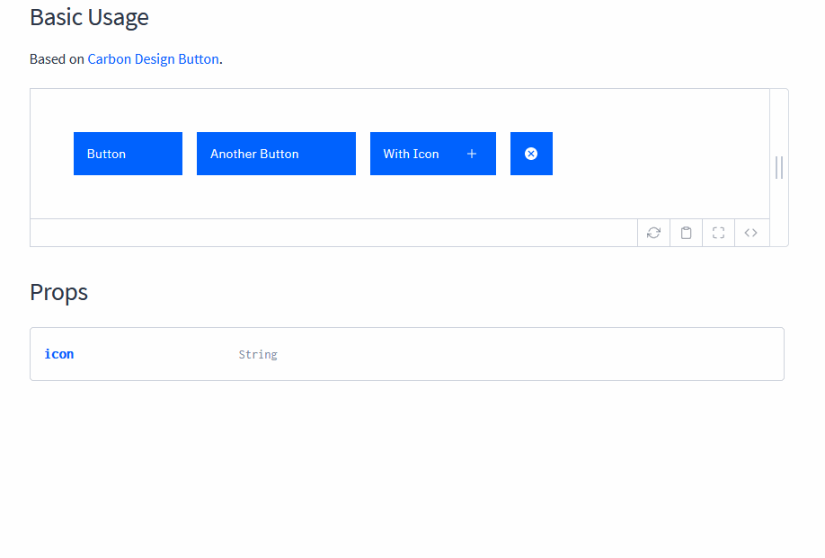

# Styled Carbon React

UI component library as standalone, styled React components, based of [IBM's Carbon Design System](https://www.carbondesignsystem.com/).


## Development

In the project folder, run:

```sh
npm run docs
```
 and then open [localhost:3000](http://127.0.0.1:3000/) in your browser. This will open the interactive documentation.

 

## Technologies

- [React](https://reactjs.org/)
- [Emotion](https://emotion.sh/)
- [Styled System](https://styled-system.com/)
- [Docz](https://www.docz.site/)
- [Babel](https://babeljs.io/)
- [Loadable Components](https://www.smooth-code.com/open-source/loadable-components/)
- [Jest](https://jestjs.io/)
